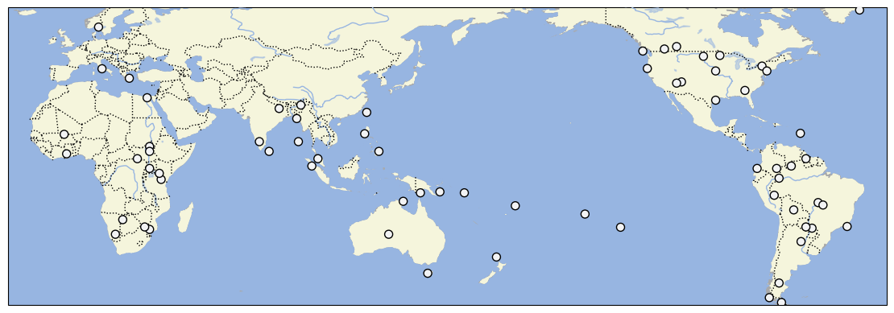

# D-PLACE dataset derived from Robert L. Carneiro's Dataset (6th edition)

## How to cite

If you use these data please cite
this dataset using the DOI of the [particular released version](../../releases/) you were using

## Description

The Carneiro dataset (6th edition) describes 618 cultural practices for 72 societies that are globally distributed and encompass a wide range of cultural complexity. The data was collected by Robert Carneiro and his team in the 1960s and 1970s for the Scale Analysis project. The original notes are deposited at the American Museum of Natural History.

This dataset is licensed under a CC-BY-4.0 license

## CLDF Datasets

The following CLDF datasets are available in [cldf](cldf):

- CLDF [StructureDataset](https://github.com/cldf/cldf/tree/master/modules/StructureDataset) at [cldf/StructureDataset-metadata.json](cldf/StructureDataset-metadata.json)