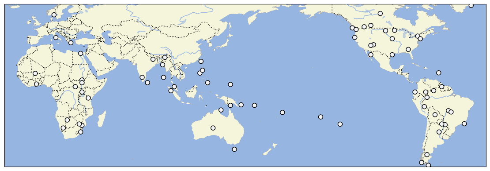

# Robert L. Carneiros Dataset

## How to cite

If you use these data please cite
this dataset using the DOI of the [particular released version](../../releases/) you were using

## Description

Robert L. Carneiro's dataset 6th edition

This dataset is licensed under a CC-BY-4.0 license

## CLDF Datasets

The following CLDF datasets are available in [cldf](cldf):

- CLDF [StructureDataset](https://github.com/cldf/cldf/tree/master/modules/StructureDataset) at [cldf/StructureDataset-metadata.json](cldf/StructureDataset-metadata.json)